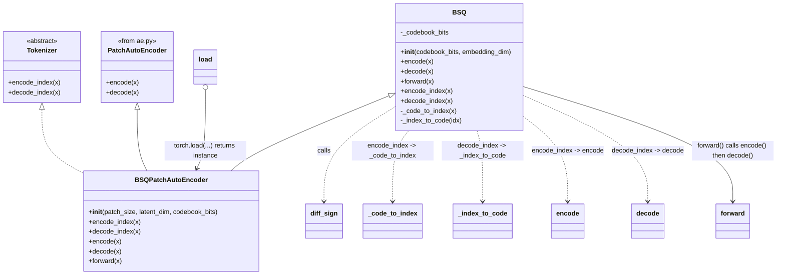

# BSQPatchAutoEncoder Class Diagram

```mermaid
classDiagram
    direction TB

    class Tokenizer {
      <<abstract>>
      +encode_index(x)
      +decode_index(x)
    }

    class PatchAutoEncoder {
      <<from ae.py>>
      +encode(x)
      +decode(x)
    }

    class BSQ {
      -_codebook_bits
      +__init__(codebook_bits, embedding_dim)
      +encode(x)
      +decode(x)
      +forward(x)
      +encode_index(x)
      +decode_index(x)
      -_code_to_index(x)
      -_index_to_code(idx)
    }

    class BSQPatchAutoEncoder {
      +__init__(patch_size, latent_dim, codebook_bits)
      +encode_index(x)
      +decode_index(x)
      +encode(x)
      +decode(x)
      +forward(x)
    }

    Tokenizer <|.. BSQPatchAutoEncoder
    PatchAutoEncoder <|-- BSQPatchAutoEncoder
    BSQ <|-- BSQPatchAutoEncoder

    %% call / data-flow annotations (dashed arrows)
    BSQ ..> diff_sign : calls
    BSQ ..> _code_to_index : encode_index -> _code_to_index
    BSQ ..> _index_to_code : decode_index -> _index_to_code
    BSQ ..> encode : encode_index -> encode
    BSQ ..> decode : decode_index -> decode
    BSQ --        > forward : forward() calls encode() then decode()

    %% load entrypoint
    load() --> BSQPatchAutoEncoder : torch.load(...) returns instance
```